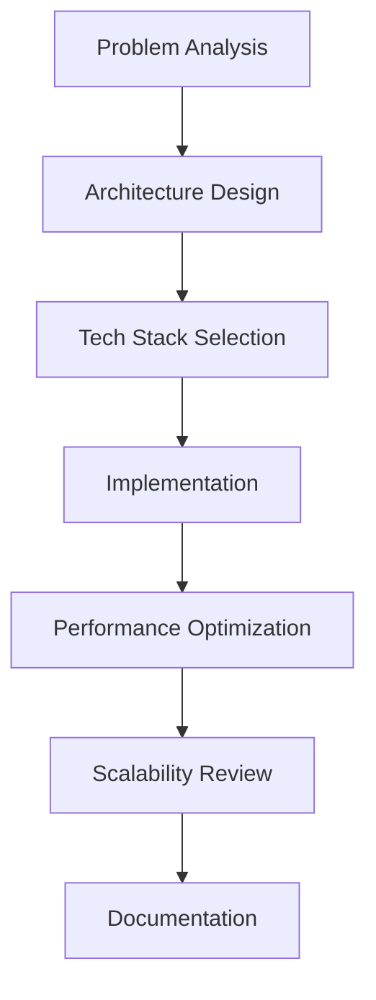

<h1 align="center">
    
</h1>
<h3 align="center">🚀 MERN Stack Developer | 3+ Years of Experience | Next.js Specialist</h3>

<p align="center">
  
</p>

---

## 🧑‍💻 About Me

```javascript
const khizar = {
  role: "Senior Full Stack Developer",
  experience: "5+ years building scalable web applications",
  focus: ["Performance Optimization", "Clean Architecture", "Developer Experience"],
  currentStack: ["Next.js 15", "React 19", "TypeScript", "TailwindCSS", "Node.js", "NEST.js"],
  databases: [ "MongoDB", "PostgreSQL", "Firebase", "Supabase"],
  cloud: ["AWS", "Firebase", "Vercel", "DigitalOcean"],
  philosophy: "Build solutions that scale both technically and organizationally"
}
```

<p align="center">
  <a href="https://pk.linkedin.com/in/khyzersaleem">
    
  </a>
</p>


              


<hr/>
 
<h2 align="center">⚒️ Languages-Frameworks-Tools ⚒️</h2>
<br/>
<div align="center">
    
    <br>
</div>

<br/>


---

## 🛠️ Technical Arsenal

### Frontend Mastery

- **Frameworks**: Next.js 15, React 19 (Server Components, RSC), Gatsby
- **State Management**: Redux Toolkit, Zustand, React Query, Apollo Client
- **Styling**: TailwindCSS, CSS Modules, Styled Components, Framer Motion
- **Testing**: Jest, React Testing Library, Cypress

### Backend Expertise

- **Runtimes**: Node.js, Deno
- **Frameworks**: Express.js, NestJS, Fastify
- **API Standards**: REST, GraphQL (Apollo Server), tRPC
- **Authentication**: JWT, OAuth, NextAuth, Firebase Auth

### Database & Storage

- **SQL**: PostgreSQL, MySQL (Advanced query optimization)
- **NoSQL**: MongoDB (Atlas, Realm), Firestore
- **ORM/ODM**: Prisma, Mongoose, Drizzle
- **Full-stack Services**: Supabase, Firebase, Appwrite

### DevOps & Cloud

- **CI/CD**: GitHub Actions, CircleCI
- **Infrastructure**: Docker, Kubernetes, Terraform
- **Cloud**: AWS (EC2, S3, Lambda), Firebase, Vercel Edge Functions
- **Monitoring**: Sentry, Datadog, LogRocket

---

## 🚀 Featured Projects

### 🌿 [Landscaping GTS](https://www.landscapinggts.com.au/) (Next.js 15, TailwindCSS, MongoDB)

- Built responsive UI with advanced booking flow and geolocation services
- Implemented ISR for dynamic content with 95%+ Lighthouse scores
- Reduced bundle size by 40% through code splitting and optimization

### 🏥 [MedRev MSO](https://medrevmso.com/) (React 19, Node.js, SQL)

- Developed HIPAA-compliant medical billing system with role-based access
- Designed complex data visualization dashboards with Chart.js
- Optimized SQL queries reducing report generation time by 70%

### 🚚 CR-Trans Dashboard (Next.js, MongoDB, Redux Toolkit)

- Created real-time logistics tracking system with Firebase Realtime Database
- Implemented offline-first capabilities with Service Workers
- Developed custom map visualizations using Mapbox GL JS

---

## 🔥 Problem-Solving Approach



1. **Deep Dive Analysis**: Break down complex problems into manageable components
2. **Modular Architecture**: Design systems with clear separation of concerns
3. **Performance First**: Implement lazy loading, caching strategies, and bundle optimization
4. **Future-Proofing**: Build with scalability and maintainability in mind
5. **Thorough Testing**: Implement unit, integration, and E2E testing

---


## 🌐 Connect With Me
<p align="center">
  <a href="https://linkedin.com/in/khyzersaleem" target="_blank" style="margin: 0 25px;">
    
  </a>
  <a href="https://instagram.com/khyzersaleem" target="_blank" style="margin: 0 15px;">
    
  </a>
  <a href="https://x.com/khyzersaleem" target="_blank" style="margin: 0 15px;">
    
  </a>
  <a href="mailto:khizarking704@gmail.com" target="_blank" style="margin: 0 15px;">
    
  </a>
</p>

---

## 📈 GitHub Stats

<p align="center">
<!--   <a href="https://github.com/khyzersaleem/github-readme-stats">
    
  </a> -->
  &nbsp;&nbsp;&nbsp;
  <a href="https://github.com/khyzersaleem/github-readme-stats">
    
  </a>
</p>

---


## 💡 Development Principles

> *"First, solve the problem. Then, write the code."* – John Johnson

- 🤍 **Component-Driven Development**: Build reusable, isolated components
- ⚡ **Performance Optimization**: Critical CSS, code splitting, image optimization
- 🔒 **Security Focus**: Input validation, proper auth flows, dependency audits
- 📝 **Clean Code**: TypeScript, ESLint, Prettier, meaningful commit messages
- 🤝 **Collaboration**: Clear documentation, PR reviews, knowledge sharing

